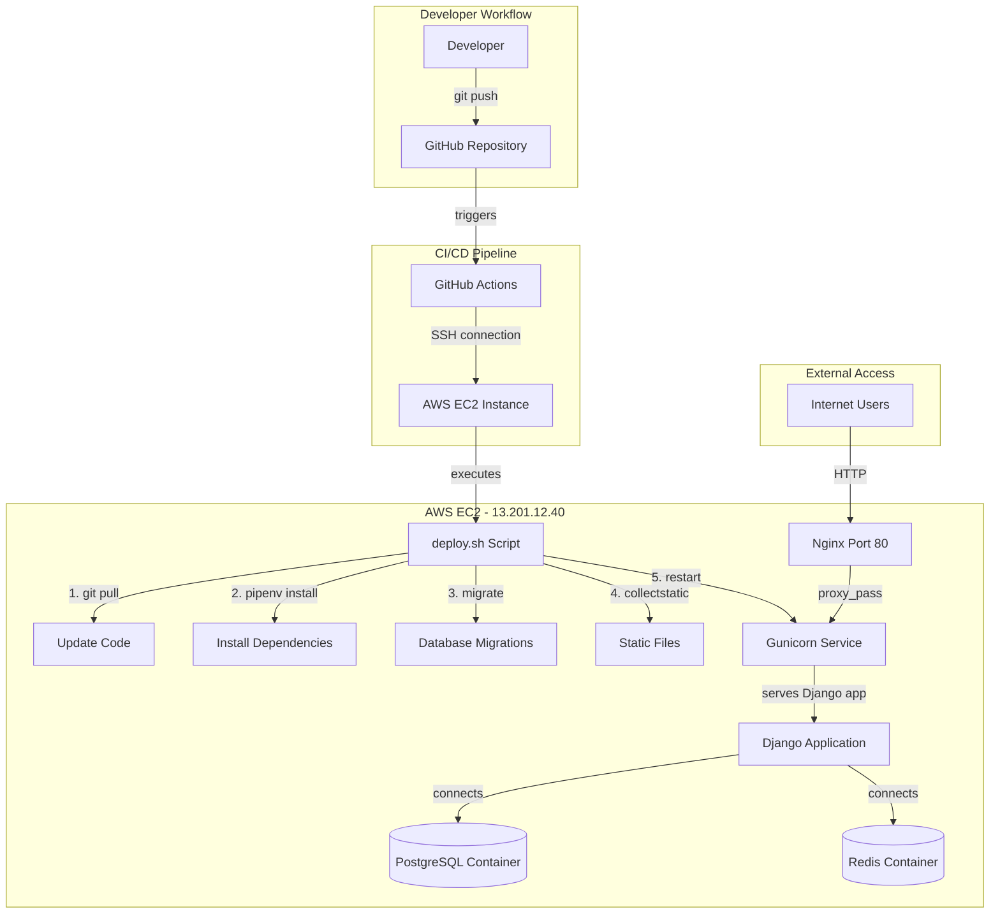

# Django gforms - Deployment Architecture Documentation

## Table of Contents
- [Overview](#overview)
- [Architecture Diagram](#architecture-diagram)
- [Components Explained](#components-explained)
- [Deployment Flow](#deployment-flow)
- [Why This Architecture](#why-this-architecture)
- [Comparison with Alternatives](#comparison-with-alternatives)
- [Maintenance and Operations](#maintenance-and-operations)

---

## Overview

The Django gforms application uses a **Continuous Deployment** architecture with GitHub Actions automatically deploying code to an AWS EC2 instance whenever changes are pushed to the main branch.

### Key Technologies
- **Application**: Django 6.0.2 (Python web framework)
- **Web Server**: Gunicorn (WSGI HTTP server)
- **Reverse Proxy**: Nginx (serves on port 80)
- **Database**: PostgreSQL (in Docker container)
- **Cache/Queue**: Redis (in Docker container)
- **CI/CD**: GitHub Actions
- **Hosting**: AWS EC2 Ubuntu 24.04
- **Dependency Management**: Pipenv

---

## Architecture Diagram



---

## Components Explained

### 1. GitHub Actions (CI/CD)
**File**: `.github/workflows/deploy.yml`

**What it is**: 
A workflow automation platform that runs on GitHub's servers.

**What it does**:
- Monitors the `main` branch for new commits
- Automatically triggers deployment when code is pushed
- Uses SSH to connect to the AWS EC2 instance
- Executes deployment commands remotely

**Why we use it**:
- ✅ Free for public repositories
- ✅ Tight integration with GitHub
- ✅ No separate CI/CD server needed
- ✅ Automatic and reliable
- ✅ Easy to configure with YAML

**Key Configuration**:
```yaml
on:
  push:
    branches: [main]  # Triggers on push to main
  workflow_dispatch:  # Allows manual triggering
```

### 2. SSH Deployment
**Tool**: `appleboy/ssh-action@v1.0.3`

**What it is**:
A GitHub Action that establishes SSH connections to remote servers.

**What it does**:
- Connects to EC2 instance using SSH key authentication
- Executes deployment script on the remote server
- Reports success or failure back to GitHub

**Why we use it**:
- ✅ Secure - uses SSH key authentication
- ✅ Simple - no complex deployment tools needed
- ✅ Direct control - full shell access to server
- ✅ Reliable - proven technology

**GitHub Secrets Required**:
- `AWS_HOST`: Server IP (13.201.12.40)
- `AWS_USERNAME`: SSH user (ubuntu)
- `AWS_SSH_PRIVATE_KEY`: Private key for authentication
- `AWS_DEPLOY_PATH`: Project directory (/home/ubuntu/gforms)

### 3. Deployment Script
**File**: `deploy.sh`

**What it is**:
A bash script that automates the deployment process.

**What it does**:
1. **Loads environment variables** from `.env` file
2. **Pulls latest code** from GitHub using `git pull`
3. **Installs dependencies** using `pipenv install`
4. **Runs database migrations** to update schema
5. **Collects static files** (CSS, JS, images)
6. **Restarts Docker services** (PostgreSQL, Redis)
7. **Restarts Gunicorn** to reload application code
8. **Health check** to verify app is running

**Why we use it**:
- ✅ Consistent deployment process
- ✅ Error handling (exits on any failure)
- ✅ Easy to modify and extend
- ✅ Logs each step for debugging

### 4. Gunicorn (Application Server)
**Service**: `gunicorn.service` (systemd)

**What it is**:
A Python WSGI HTTP server that runs Django applications in production.

**What it does**:
- Runs multiple worker processes (5 workers)
- Handles HTTP requests from Nginx
- Executes Django application code
- Manages application lifecycle

**Why we use it**:
- ✅ Production-ready WSGI server
- ✅ Multi-worker for handling concurrent requests
- ✅ Reliable and well-tested
- ✅ Integrates perfectly with Django
- ✅ Managed by systemd (auto-restart on failure)

**Configuration**:
```ini
ExecStart=/path/to/virtualenv/bin/gunicorn \
          --workers 5 \               # 5 concurrent workers
          --bind 127.0.0.1:8000 \     # Listen on localhost:8000
          forms.wsgi:application      # Django WSGI application
```

### 5. Nginx (Reverse Proxy)
**Port**: 80 (HTTP)

**What it is**:
A high-performance web server and reverse proxy.

**What it does**:
- Listens for HTTP requests on port 80
- Forwards requests to Gunicorn (port 8000)
- Serves static files directly (CSS, JS, images)
- Handles SSL/TLS (if configured)
- Load balancing (if multiple Gunicorn instances)

**Why we use it**:
- ✅ Much faster than serving directly with Python
- ✅ Handles static files efficiently
- ✅ Provides security features
- ✅ Industry standard
- ✅ Can handle SSL/TLS certificates
- ✅ Better at handling slow clients

**Flow**:
```
Internet → Nginx (port 80) → Gunicorn (port 8000) → Django App
```

### 6. PostgreSQL Database
**Container**: `postgresql` (Docker)

**What it is**:
A powerful, open-source relational database.

**What it does**:
- Stores all application data (users, forms, responses)
- Handles complex queries and transactions
- Ensures data integrity and consistency
- Persistent storage via Docker volumes

**Why we use it**:
- ✅ Production-grade database
- ✅ ACID compliant (reliable)
- ✅ Supports complex queries
- ✅ Django's preferred database
- ✅ Runs in Docker for isolation
- ✅ Easy backup and migration

**Configuration**:
```yaml
postgresql:
  image: postgres:latest
  ports: ["5432:5432"]
  volumes: [postgresql_data:/var/lib/postgresql]
```

### 7. Redis Cache
**Container**: `redis` (Docker)

**What it is**:
An in-memory data structure store used as cache and message broker.

**What it does**:
- Caches frequently accessed data
- Stores session data
- Message queue for background tasks
- Improves application performance

**Why we use it**:
- ✅ Extremely fast (in-memory)
- ✅ Reduces database load
- ✅ Improves response times
- ✅ Useful for background job queues
- ✅ Runs in Docker for isolation

### 8. Pipenv (Dependency Management)
**What it is**:
A tool that combines pip (package installer) and virtualenv (isolated environment).

**What it does**:
- Manages Python dependencies
- Creates isolated virtual environments
- Ensures consistent dependency versions
- Lock file (`Pipfile.lock`) for reproducibility

**Why we use it**:
- ✅ Better than requirements.txt
- ✅ Deterministic builds
- ✅ Automatic dependency resolution
- ✅ Security scanning
- ✅ Development vs production dependencies

---

## Deployment Flow

### Step-by-Step Process

1. **Developer Pushes Code**
   ```bash
   git add .
   git commit -m "Add new feature"
   git push origin main
   ```

2. **GitHub Actions Detects Push**
   - GitHub triggers the workflow
   - Checks out the code
   - Prepares SSH connection

3. **SSH Connection Established**
   - GitHub Actions connects to 13.201.12.40
   - Uses private key from secrets
   - Authenticates as `ubuntu` user

4. **Git Pull Latest Code**
   ```bash
   cd /home/ubuntu/gforms
   git pull origin main
   ```
   - Fetches latest commits
   - Updates working directory

5. **Install/Update Dependencies**
   ```bash
   pipenv install --deploy
   ```
   - Reads `Pipfile.lock`
   - Installs exact versions
   - Uses virtual environment

6. **Run Database Migrations**
   ```bash
   pipenv run python manage.py migrate
   ```
   - Applies schema changes
   - Creates/modifies tables
   - Ensures database is up-to-date

7. **Collect Static Files**
   ```bash
   pipenv run python manage.py collectstatic --noinput
   ```
   - Gathers CSS, JS, images
   - Copies to `staticfiles/` directory
   - Ready for Nginx to serve

8. **Restart Services**
   ```bash
   sudo systemctl restart gunicorn
   docker-compose restart
   ```
   - Reloads application code
   - Restarts database containers
   - Applies new configuration

9. **Health Check**
   ```bash
   curl http://localhost:8000
   ```
   - Verifies app responds
   - Confirms successful deployment

10. **Deployment Complete**
    - GitHub Actions reports success ✅
    - New code is live
    - Users see updated version

### Timeline
Typical deployment takes **30-60 seconds** from push to live.

---

## Why This Architecture

### Decision Rationale

#### 1. **Why GitHub Actions over Jenkins/CircleCI/Travis?**
- ✅ No separate server to maintain
- ✅ Free for this use case
- ✅ Native GitHub integration
- ✅ Simple YAML configuration
- ✅ Pre-built actions available

#### 2. **Why SSH Deployment over Docker/Kubernetes?**
- ✅ **Simplicity**: Single EC2 instance, no orchestration needed
- ✅ **Cost**: No additional container registry fees
- ✅ **Speed**: Direct deployment, no image building
- ✅ **Familiarity**: Standard Linux operations
- ✅ **Appropriate Scale**: Perfect for small-medium applications

**When to use Docker/K8s instead**:
- Multiple EC2 instances needed
- Microservices architecture
- Need container orchestration
- Frequent scaling up/down

#### 3. **Why Gunicorn over uWSGI/mod_wsgi?**
- ✅ Django's recommended WSGI server
- ✅ Simple configuration
- ✅ Excellent documentation
- ✅ Pre-fork worker model
- ✅ Actively maintained

#### 4. **Why Nginx over Apache?**
- ✅ Better performance for static files
- ✅ Lower memory footprint
- ✅ Asynchronous architecture
- ✅ Industry standard for Python apps
- ✅ Simple reverse proxy configuration

#### 5. **Why PostgreSQL over MySQL/MongoDB?**
- ✅ Django's best-supported database
- ✅ Advanced features (JSON, arrays, window functions)
- ✅ Strong data integrity
- ✅ ACID transactions
- ✅ Better for relational data

#### 6. **Why Redis over Memcached?**
- ✅ More data structures (lists, sets, sorted sets)
- ✅ Persistence options
- ✅ Pub/Sub for real-time features
- ✅ Can be used for Celery (background tasks)
- ✅ Better ecosystem

---

## Comparison with Alternatives

### Current Architecture vs Docker/ECR

| Aspect | Current (SSH Deployment) | Docker/ECR Alternative |
|--------|-------------------------|----------------------|
| **Complexity** | ⭐⭐ Low | ⭐⭐⭐⭐ High |
| **Deployment Speed** | 🚀 30-60 seconds | 🐢 3-5 minutes (image build) |
| **Cost** | 💰 Just EC2 | 💰💰 EC2 + ECR + bandwidth |
| **Scalability** | Single instance | Multiple instances easy |
| **Rollback** | Git revert + redeploy | Tag previous image |
| **Portability** | Server-specific | Run anywhere |
| **Learning Curve** | Easy | Moderate |
| **Best For** | Small-medium apps | Large, distributed apps |

### When to Migrate to Docker/ECR

Consider migrating when you need:
- ✅ Multiple EC2 instances (load balancing)
- ✅ Zero-downtime deployments
- ✅ Microservices architecture
- ✅ Kubernetes orchestration
- ✅ Complex environment management
- ✅ Team already Docker-proficient

---

## Maintenance and Operations

### Daily Operations

**Monitor Application**:
```bash
# Check Gunicorn status
sudo systemctl status gunicorn

# View logs
sudo journalctl -u gunicorn -f

# Check website
curl http://13.201.12.40
```

**Monitor Database**:
```bash
# Check container status
docker ps

# View PostgreSQL logs
docker logs postgresql

# Connect to database
docker exec -it postgresql psql -U postgres -d gforms-db
```

### Common Tasks

**Manual Deployment**:
```bash
ssh -i ~/.ssh/gforms_deploy_nopass ubuntu@13.201.12.40
cd ~/gforms
bash deploy.sh
```

**Rollback to Previous Version**:
```bash
git revert HEAD
git push origin main
# GitHub Actions auto-deploys the revert
```

**View Deployment History**:
- GitHub → Actions tab
- Shows all deployments with timestamps
- Click any run to see detailed logs

**Database Backup**:
```bash
docker exec postgresql pg_dump -U postgres gforms-db > backup.sql
```

**Restart Everything**:
```bash
sudo systemctl restart gunicorn
docker-compose restart
sudo systemctl restart nginx
```

### Security Best Practices

✅ **Implemented**:
- SSH key authentication (no passwords)
- GitHub Secrets for sensitive data
- Firewall rules (Security Groups)
- Environment variables for config
- `DEBUG=False` in production
- `ALLOWED_HOSTS` configured

⚠️ **Recommended Next Steps**:
- [ ] SSL/TLS certificate (HTTPS)
- [ ] Automated database backups
- [ ] Log aggregation (CloudWatch)
- [ ] Monitoring/alerting (UptimeRobot)
- [ ] WAF (Web Application Firewall)
- [ ] Regular security updates

---

## Summary

This architecture provides a **simple, reliable, and cost-effective** deployment pipeline for the Django gforms application.

**Strengths**:
- Fully automated deployments
- Fast deployment cycle (under 1 minute)
- Low operational complexity
- Industry-standard components
- Easy to understand and maintain

**Appropriate For**:
- Single-instance applications
- Small to medium teams
- MVP and early-stage products
- Budget-conscious deployments

**Future Migration Path**:
When you need to scale, you can migrate to:
1. Docker containers (containerize Django app)
2. AWS ECR (store Docker images)
3. AWS ECS/EKS (orchestrate containers)
4. Multi-region deployment
5. CDN for static files

For now, this architecture serves your needs perfectly! 🚀
